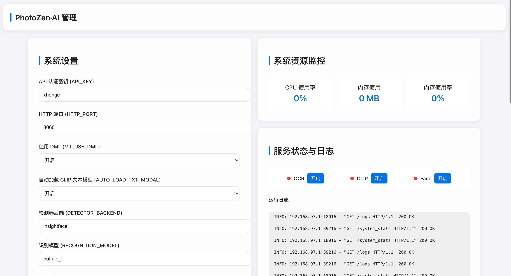
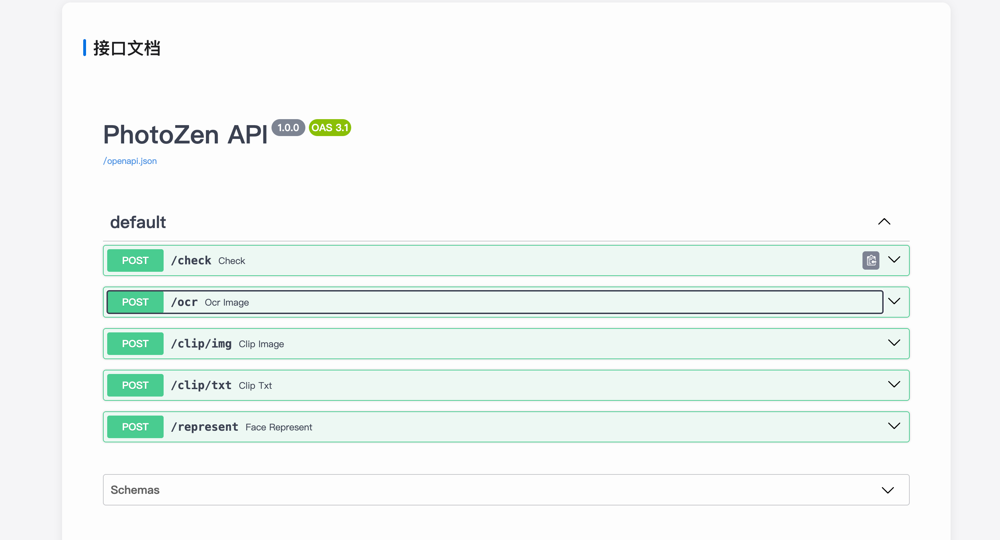

# PhotoZen AI

PhotoZen AI 是一个集成了 OCR、CLIP 和人像识别功能的智能相册 AI 服务中心。该项目基于 FastAPI 框架构建，提供了强大的图像处理和分析能力。

## 项目截图

<div align="center">
  
  <p>主界面展示</p>
  
  
  <p>API接口服务</p>
</div>

## 主要功能

- **OCR 文字识别**：支持从图片中提取文字信息
- **CLIP 图像理解**：基于 OpenAI 的 CLIP 模型，实现图像语义理解
- **人像识别**：支持人脸检测和特征提取
- **Docker 部署**：提供完整的容器化部署方案
- **API 接口**：提供 RESTful API 接口，方便集成
- **系统监控**：支持服务状态监控和日志查看

## 技术栈

- FastAPI
- Docker
- CLIP
- InsightFace
- OpenCV
- PaddleOCR

## 安装说明

### 使用 Docker 部署

1. 构建镜像：
```bash
docker build -t xhongc/photozen-ai .
```

2. 运行容器：
```bash
docker run -d -p 8060:8060 -v /var/run/docker.sock:/var/run/docker.sock --name photozen-ai photo-ai
```

### 使用 Docker Compose 部署

1. 确保已安装 Docker 和 Docker Compose

2. 使用 docker-compose 启动服务：
```bash
docker-compose up -d
```

3. 查看服务状态：
```bash
docker-compose ps
```

4. 停止服务：
```bash
docker-compose down
```

## API 接口

### OCR 接口
- 路径：`/ocr`
- 方法：POST
- 功能：图片文字识别
- 示例：
```bash
curl -X POST "http://localhost:8060/ocr" \
     -H "api-key: your-api-key" \
     -F "file=@/path/to/your/image.jpg"
```

### CLIP 接口
- 路径：`/clip/img` 和 `/clip/txt`
- 方法：POST
- 功能：图像语义理解和文本匹配
- 示例：
```bash
# 图像理解
curl -X POST "http://localhost:8060/clip/img" \
     -H "api-key: your-api-key" \
     -F "file=@/path/to/your/image.jpg"

# 文本匹配
curl -X POST "http://localhost:8060/clip/txt" \
     -H "api-key: your-api-key" \
     -H "Content-Type: application/json" \
     -d '{"text": "描述图片内容的文本"}'
```

### 人像识别接口
- 路径：`/represent`
- 方法：POST
- 功能：人脸特征提取
- 示例：
```bash
curl -X POST "http://localhost:8060/represent" \
     -H "api-key: your-api-key" \
     -F "file=@/path/to/your/face.jpg"
```

### 系统管理接口
- `/check`：服务状态检查


## 常见问题

### Q: 如何获取 API 密钥？
A: 在首次部署时，系统会自动生成 API 密钥，可以在环境变量中配置。

### Q: 服务启动失败怎么办？
A: 请检查以下几点：
1. 确保 Docker 和 Docker Compose 已正确安装
2. 检查端口 8060 是否被占用
3. 查看容器日志：`docker logs photozen-ai`

### Q: 如何提高识别准确率？
A: 可以尝试以下方法：
1. 确保图片质量清晰
2. 调整环境变量中的检测阈值
3. 使用更高性能的 GPU

## 许可证

本项目采用 MIT 许可证，详情请参见 LICENSE 文件。

## 贡献

欢迎提交 Issue 和 Pull Request 来帮助改进项目。
